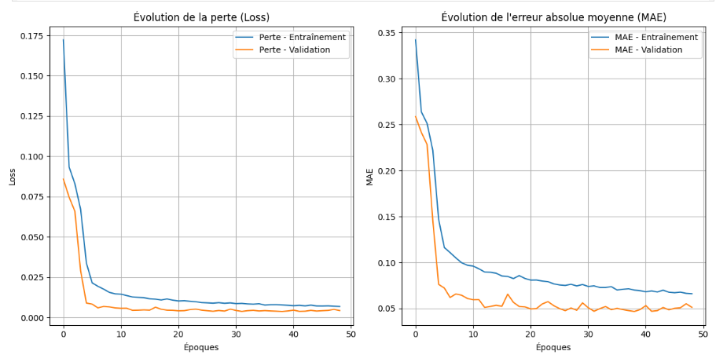
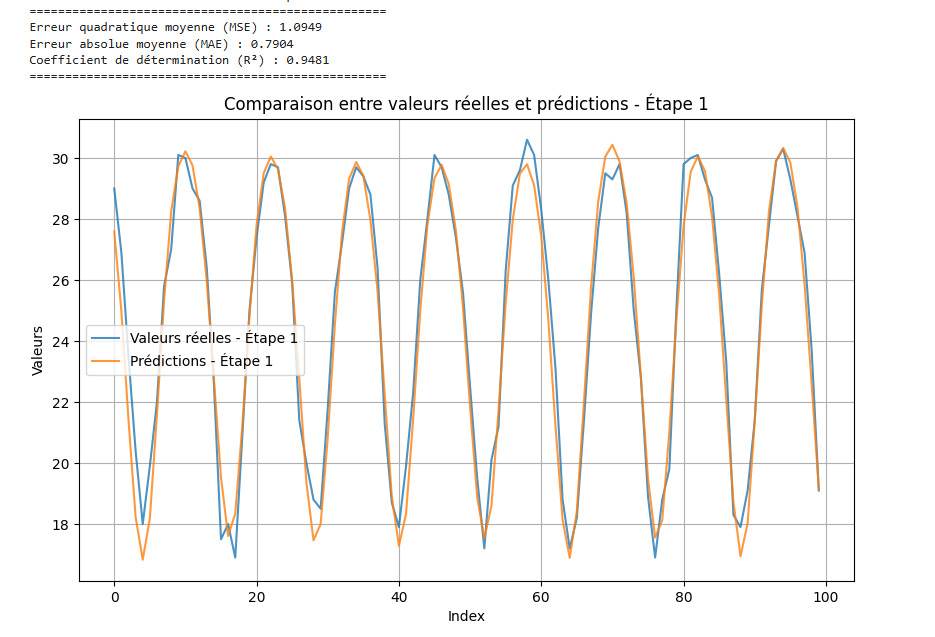
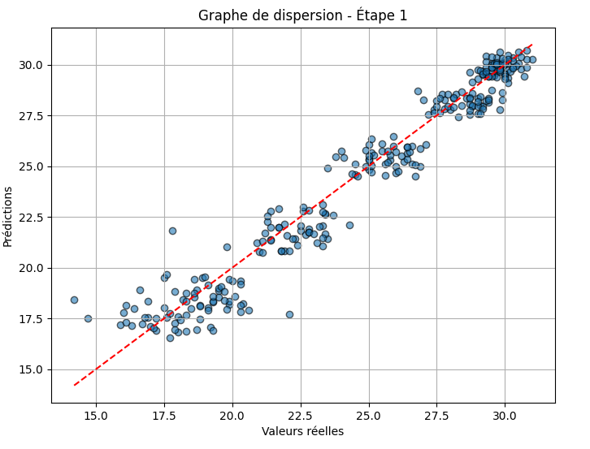

# Prédictions climatiques pour soutenir l'agriculture dans la région d'Hanoi 

---

##  Résumé du projet

Ce projet met en œuvre un modèle de deep learning basé sur des réseaux de neurones **LSTM** (Long Short-Term Memory), spécialement adaptés aux séries temporelles, pour analyser et prédire des variables climatiques importantes telles que la température. L'objectif est d'aider les agriculteurs et les décideurs à mieux planifier leurs activités agricoles face aux variations climatiques.

- **Type de données analysées** : Données climatiques historiques (température, humidité, etc.).
- **Approche utilisée** : Réseaux LSTM combinés avec des techniques de régularisation pour éviter le surapprentissage.
- **Impact attendu** : Une meilleure gestion agricole, une anticipation des changements climatiques et une réduction des risques liés aux conditions météorologiques.

---

##  Résultats principaux

### Courbes de performance du modèle

**Évolution de la perte et de l'erreur absolue moyenne (MAE)** pendant l'entraînement et la validation.

---

### Comparaison des valeurs réelles et des prédictions

Une comparaison directe entre les **valeurs réelles** et les **prédictions du modèle**, démontrant une forte corrélation.

---

### Graphe de dispersion

Un graphique montrant la **relation linéaire** entre les valeurs réelles et les prédictions.

---

##  Objectifs détaillés

1. **Prédire avec précision les variables climatiques** pour une meilleure planification agricole.
2. **Exploiter les données historiques** pour capturer les tendances climatiques à long terme.
3. **Utiliser un modèle LSTM performant**, connu pour sa capacité à gérer les dépendances temporelles.
4. **Évaluer les performances du modèle** avec des métriques comme le MSE, MAE et R².

---

##  Outils et technologies

- **Langage de programmation** : Python 3.8+
- **Framework** : TensorFlow/Keras
- **Bibliothèques utilisées** :
  - NumPy
  - Pandas
  - Scikit-learn
  - Matplotlib
  - Seaborn
  - TensorFlow

---

---

##  Résumé des performances

| **Métrique**              | **Valeur** |
|---------------------------|------------|
| Erreur quadratique moyenne (**MSE**) | 1.0949     |
| Erreur absolue moyenne (**MAE**)     | 0.7904     |
| Coefficient de détermination (**R²**) | 0.9481     |

Ces résultats indiquent une forte capacité du modèle à prédire les tendances climatiques avec précision.

---
# HABACK Marthe Désirée Olivia
